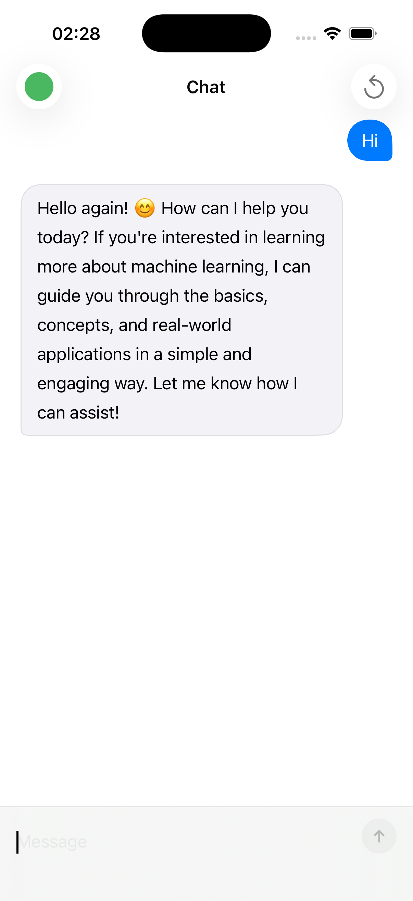

# Quaynor Python + swift demo

This repository demonstrates wiring a **Python backend** that uses the [**Quaynor** Python bindings](https://www.quaynor.site/python/) (`ChatAsync`, streaming) to a **native Swift** client. The iOS app talks to a small FastAPI service that loads a Quaynor chat session and streams tokens to the UI.

## Demo

## Layout

- **`backend/`** — FastAPI app (`server.py`) using `quaynor` for chat and NDJSON streaming on `/chat/stream`.
- **`quaynor_swift/`** — SwiftUI app and `ChatClient` (defaults to `http://127.0.0.1:8765`).
- **`quaynor_swift.xcodeproj`** — Open this in Xcode to build and run the Swift client.

## Running locally (overview)

1. **Backend:** From `backend/`, install dependencies (`requirements.txt`), set `QUAYNOR_MODEL` if you want a non-default model, then run the app with Uvicorn on a port that matches the Swift client (e.g. `8765`).
2. **Swift:** Run the app in the simulator pointing at the same host/port, or set `ChatClient.baseURL` to your Mac’s LAN IP when using a physical device.

See the docstrings in `backend/server.py` and `quaynor_swift/ChatClient.swift` for API and configuration details.
